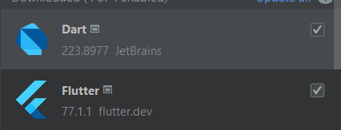

# App for the Merchants Association of Sants de Creu Coberta

The purpose of this application is to be a communication tool among all the merchants of the Sants de Creu Coberta association. To achieve this, the application contains a forum system where merchants can make different publications in the forums. There are different forums in the application which allows users to have better organization of the publications.

## Forums
The app contains different forums and not all are shown to all users. There are two main forums:

**General Forum:** All application users have access to this forum, and any store can make posts in it.

**Technician's Forum:** This forum is intended for administrators and technicians of the application to make posts to inform the rest of the merchants. Therefore, all users can see the forum posts but only users with special permissions can make posts.

**Custom Forums:** These forums are created by the administrator from the admin panel and they designate which users can view the forum and make posts in it.

## User Management

From the app, a store owner can register their employees so that they can view and post in the different forums that the store has access to.

## Translations

The app is available in different languages. It automatically detects the language of the device and loads the app in one language or another accordingly. The available languages are:
- English
- Spanish
- Catalan
- French
- German
- Portuguese

# Technologies
 

# Install Flutter on Linux

**Download Flutter SDK**

[Download SDK](https://storage.googleapis.com/flutter_infra_release/releases/stable/linux/flutter_linux_3.19.1-stable.tar.xz)

**Extract the downloaded file to a location of your choice**

```bash
cd ~/development
tar xf ~/Downloads/flutter_linux_vX.X.X-stable.tar.xz
```

**Add the Flutter tool to your PATH**

```bash
export PATH="$PATH:`pwd`/flutter/bin"
```

**Verify your installation**

```bash
flutter doctor
```

# Android Studio Setup

**Installing plugins**

To be able to use Flutter, you need to install the 'Flutter' and 'Dart' plugins in your project. To do this, go to `File>Settings>Plugins`.

 

**Recommended Plugins**

If you intend to develop in Flutter, it is recommended to use the 'Flutter snippets' plugin. This plugin will allow you to autocomplete your code with exclusive flutter functions.

 

**Set Flutter SDK path**

Inside Android Studio, go to ``File>Settings``, once in the tab go to ``Language & Frameworks>Flutter`` and indicate the path of your Flutter SDK, once done apply the changes.

 

# Build Project

**Clone the GitHub repository:**

    git clone https://github.com/Margaux-Boileau/app-merchants-association.git

**Compile in Android Studio:**

Once the repository is cloned and after installing Flutter, open the IDE and get the dependencies, to do this open the IDE's own terminal and execute the following command:

```bash
flutter pub get
```

When the dependencies have been obtained, you will have to load the translation files, to do this execute the following command:

```bash
flutter gen-l10n
```

Once this is done, you can compile the project.

 

# App Demo (click on logo)

[](https://drive.google.com/file/d/1ayF2J8Dt34cIKMQJ-hLnnz1CwsGN4eta/view?usp=sharing)

# App APK

Are you using Android? Download our app here.

 

Can't scan the code? Download the apk from this [link](https://drive.google.com/file/d/1SAdtwZzslBFxYkaTbsNNm4LgFwDPxnB7/view?usp=sharing)