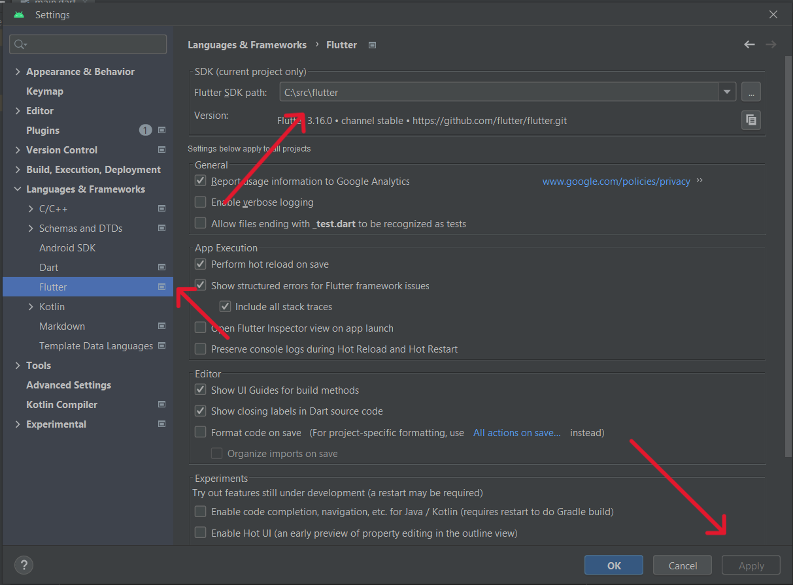
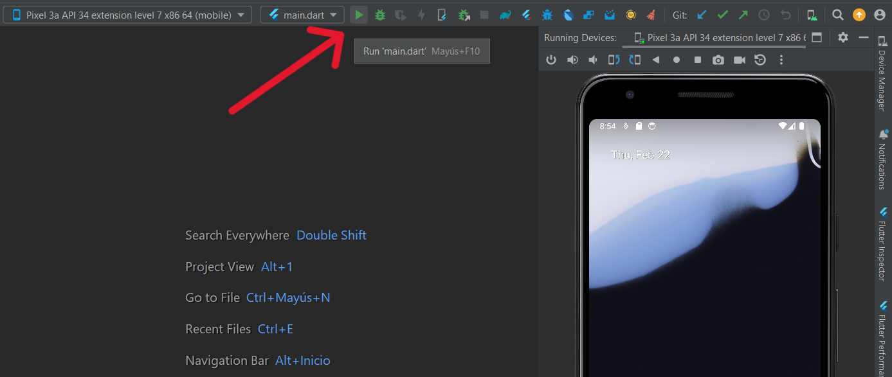

# App per als comerciants de l'associació de Sants de Creu coberta

La intencion de esta apicacion ser un una herramienta de comunicacion entre todos los comerciantes de l'associació de Sants de Creu coberta. Para ello la aplicacion contiene un sistema de foros donde los comerciantes pueden hacer diferentes publicacion en los foros. Hay diferentes foros en la aplicacion lo que permite a los usuarios tener una mayor organizacion de las publicaciones.

## Foros
La app contiene diferentes foros y no todos se muestran a todos los usuarios. Hay dos foros principales:

**Foro general:** A este foro tienen acceso todos los usuarios de la aplicacion y cualquier tienda puede hacer publicaciones en este.

**Foro de tecnicos:** Este foro esta destinado para que los administradores y tecnicos de la aplicacion puedan hacer publicaciones para informar al resto de comerciantes. Por lo que todos los usuarios pueden ver las publicaciones del foro pero solo usuarios con permisos especiales pueden hacer publicaciones.

**Foros personalizados:** Estos foros son creados por el administrador desde el panel de admin y el es el que designa que usuarios pueden ver el foro y hacer publicaciones en este

## Gestion de usuarios

Desde la app el dueño de una tienda puede registrar a los empleados de esta para que asi estos puedan ver y publicar en los diferentes foros a los que tenga acceso la tienda

## Traucciones

La app esta disponible en diferentes lenguajes. Esta detecta automaticamente el idioma del dispositivo y segun este carga la app en un idioma u otro. Los idiomas disponibles son:
- Ingles
- Español
- Catalan
- Frances
- Aleman
- Portuges

# Technologies
 

# Instalar flutter en linux

**Descargar flutter sdk**

[Download sdk](https://storage.googleapis.com/flutter_infra_release/releases/stable/linux/flutter_linux_3.19.1-stable.tar.xz)

**Extrae el archivo descargado en una ubicación de tu elección**

```bash
cd ~/development
tar xf ~/Downloads/flutter_linux_vX.X.X-stable.tar.xz
```

***Agrega la herramienta de Flutter a tu ruta (PATH)**

```bash
export PATH="$PATH:`pwd`/flutter/bin"
```

**Verifica tu instalacion**

```bash
flutter doctor
```

# Configuracion Android Studio

**Instalacion de pluggins**

Para poder utilizar flutter debes intalar el plugin 'Flutter' y 'Dart' en tu proyecto. Para eso dirigete a `File>Settings>Plugins`

 

**Pluggins recomendados**

Si tienes intencion de desarollar en flutter es recomentable usar el pluggin ´Flutter snippets´. Este pluggin te permitira autocompletar tu codigo con funciones exclusivas de flutter

 

**Indicar path de flutter SDK**

Dentro de Android Studio dirigete a ``File>Settings``, una vez en la pestaña dirigete en el menu de la derecha a ``Language & Frameworks>Flutter`` y indica el path de tu SDK de flutter, una vez echo aplica los cambios

 

# Compilar proyecto

**Clonar el repositorio de GitHub:**

    git clone https://github.com/Margaux-Boileau/app-merchants-association.git

**Compilar en antroid studio:**

Una vez clonado el el repositorio y despues de instalar flutter abrimos el IDE y hacemos un get de las dependencias, para ello abre el propio terminal del IDE y ejecuta el siguiente comando:

```bash
flutter pub get
```

Cuando se haya realizado el get de las dependencias tengras que cargar los ficheros de traducciones, para ello ejecuta el siguiente comand:

```bash
flutter gen-l10n
```


Una vez echo esto ya puedes compilar el proyecto

 


# Dema de la app (clicar en logo)

[](https://drive.google.com/file/d/1a2-2fYGBAlG_Kf2jA3iJ-jDS3jjFYrkf/view?usp=sharing)

# App apk

Usas android? Descarga aqui nuestra app

 

No puedes escanear el codgio? Descarga la apk desde este [link](https://drive.google.com/file/d/1SAdtwZzslBFxYkaTbsNNm4LgFwDPxnB7/view?usp=sharing)